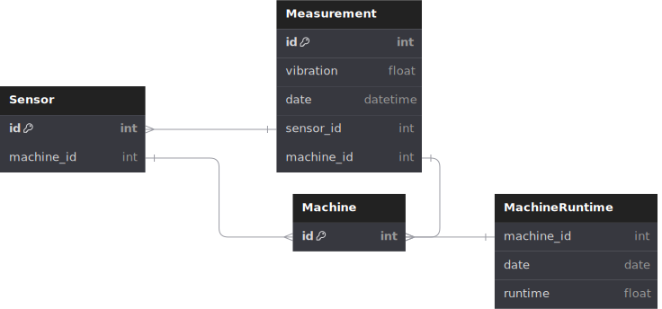

# ARCHITECTURE

This backend is built using Docker, which streamlines the processes of building and starting up the application.

The application comprises two services:

The Django backend: After the build process, the application code is hosted in a Docker container.
The Database: This is set up prior to the Django application, as it's a prerequisite for the backend to function.

## SERVICES DIAGRAM

## DB DIAGRAM

